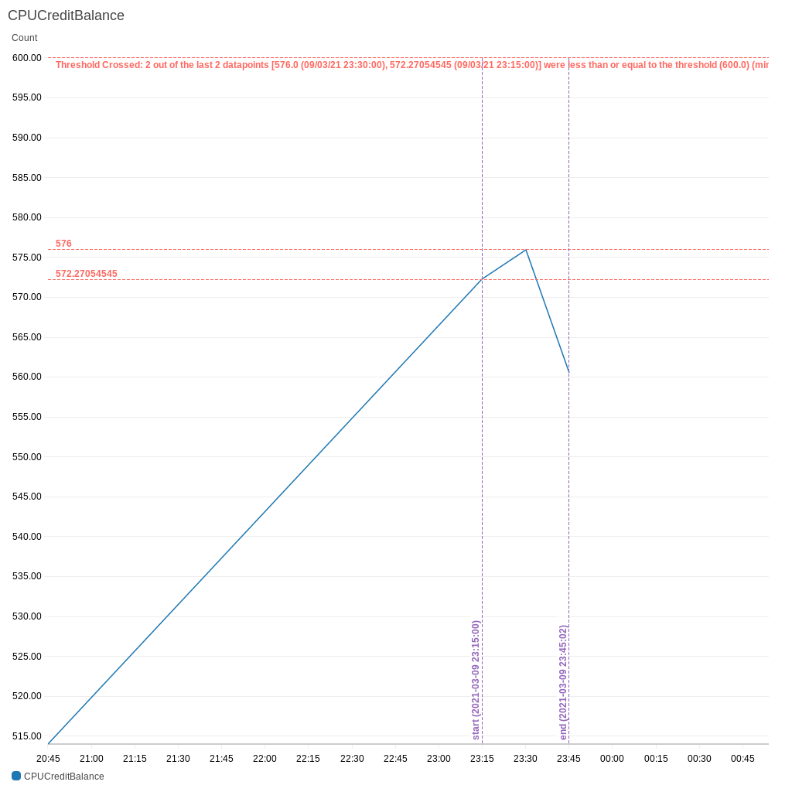

# riFT - An elastic EC2 instance monitoring tool.

## Table of contents
* [Inspiration](#inspiration)
* [Introduction](#introduction)
* [Functionality](#functionality)
* [Technologies](#technologies)
* [Architecture](#architecture)
* [Setup](#setup)
* [Delete](#delete)
* [Operations](#operations)
* [Notification](#notification)
    * [CPU Utilization metric](#cpu-utilization-metric)
    * [CPU Credit Balance metric](#cpu-credit-balance-metric)
    * [CPU Processes usage metric](#cpu-processes-usage-metric)


<a name="inspiration"></a>

## Inspiration

This tool is motivated by my growing interest in FinOps and my current and past professional engagements, which involved cost and platform optimization work. From my experiences, I have learned the challenges thrown in by the expanding problem of cloud waste and the significance of cost optimization. This solution is a small effort to solve the problem in a cost-effective native manner. At the core, it is a monitoring and alerting solution that can be integrated with MS Teams and also can send notifications to email addresses.  As an enthusiast of the software engineering principle 'Separation Of Concerns', I have named this tool riFT. It stands up to its name by being elastic enough to decouple the concern of adjusting monitoring set up from the evolving infrastructure. 
   
<a name="introduction"></a>

## Introduction
One of the best way to save money in the AWS cloud is to make the best use of T class instances. AWS offers burstable EC2 Instance types (T2, T3 and T4), balancing cost and performance. These instances provide a baseline CPU performance with the ability to burst to a higher level when workloads demand it. The ability to burst is governed by CPU credits, which are automatically accrued and spent according to utilization.
Forecasting and reacting to changes in CPU credits can become onerous and when not correctly managed, can result in unexpected downtime and costs.
The tool automatically creates and updates CPU alarms configuration to monitor burstable performance instances, allowing for proactive responses and the prevention of incidents.

<a name="functionality"></a>

## Functionality 

The tool monitors the burstable instances by automatically creating/updating the CPU credit balance alarms, CPU utilization alarms and a composite alarm. The alarms get created when a new burstable instance is launched. The alarms get modified with new thresholds when an instance type is changed to a new burstable instance type. The alarms get deleted when the instance is terminated or on changing the instance type to a non-burstable type. 

The default threshold calculation behaviour is as below. 

For the CPU credit balance alarm, below method is used to calculate the threshold.
```
    credits_used_per_vCPU_hour_above_baseline_usage = 60
        threshold = credits_used_per_vCPU_hour_above_baseline_usage * Number of vCPUs
    if threshold > 80% of Maximum CPU credits of the given instance type
        threshold = 20 % of Maximum CPU credits 
```
For the CPU utilization alarm, the threshold is the baseline CPU utilization given in the credit table provided by AWS. [Refer AWS documentation](https://docs.aws.amazon.com/AWSEC2/latest/UserGuide/burstable-credits-baseline-concepts.html) 

<a name="technologies"></a>

## Technologies

* Python 3.8
* Terraform 1.0
* AWS

<a name="architecture"></a>

## Architecture
The tool architecture is serverless, driven by events. It uses a set of AWS Lambda functions as workers, which perform the core processing orchestrated by EventBridge.


<a name="setup"></a>

## Setup

##### Prerequisites 
Install Terraform 1.0 and Python 3.8

##### Once you have the prerequisites taken care of you can deploy the tool by executing below script and providing required input to it. 

```
 cd deployment/bin
 ./setup.sh
```
The *setup* process will ask you to provide a *deployment-id* or select the default value.
The tool requires an IAM user which has below permissions. You can provide an existing IAM user or let the *setup* process
create a user for you. 
```
{
    "Version": "2012-10-17",
    "Statement": [
        {
            "Action": [
                "execute-api:*"
            ],
            "Effect": "Allow",
            "Resource": "*"
        }
    ]
}
```
As the solution gets deployed using Terraform, a bucket is created to store the Terraform state. The *setup* process puts the bucket name in the SSM Parameter store. Along with the bucket name a number of other parameters are stored which constitute the **metadata** of the deployment. The metadata is required to makes updates to the configuration. You should not delete below params unless you want to delete the whole infrastucture.


*/rift/**deployment-id**/user/credentials* - Stores the user Access Key and Secret Access Key


*/rift/**deployment-id**/deployment-id* - Stores the deployment Id which identifes the resources


*/rift/**deployment-id**/tf-state-bucket* - Stores the Terraform state bucket

You can access the logs of the *setup* process from below location.
```
cd deployment/bin/logs
```

<a name="delete"></a>

## Delete
##### Execute below script to delete the infrastructure.
```
 cd deployment/bin
 ./delete.sh
```
You need to give the *deployment-id* which was given as input to the *setup* process.
The delete process fetches the bucket name belonging to the given *deployment-id* from the metadata. All the resources belonging to the given *deployment-id* are deleted. The IAM User, S3 bucket, Secret and metadata stored in the SSM Parameter store can be deleted manually. 

<a name="operations"></a>

## Operations

After deploying **riFT** you can use below script to create alarms for existing instances. You can also modify alarm Period, Datapoints, and Evaluation Periods by executing the below script. The script takes *deployment-id* as input.  
```
cd backend/bin
./maintenance.sh
```
It puts the new values in below SSM parameter params and then publish *update* or *create* notifications.
*/rift/**deployment-id**/config/alarms/period* 


*/rift/**deployment-id**/config/alarms/datapoints* 


*/rift/**deployment-id**/config/alarms/evaluation-periods* 


Refer [CloudWatch Alarms](https://docs.aws.amazon.com/AmazonCloudWatch/latest/monitoring/ConsoleAlarms.html)
<a name="notification"></a>

## Notification
#### Recieve notification
Subscribe to the SNS topic *receive-ec2-notifications-**deployment-id*** with email address to recieve notifications.
As part of the alert two notifications are sent out - one to the email address and other to the MS teams channel if you have provided the webhook in the ssm parameter store param 


*/rift/**deployment-id**/config/subscribers/ms-teams/webhook/url*


The MS teams notification looks as below - it has latest CPU Utilization metric, CPU Credit Balance metric and optional Processes CPU Usage metric.


<a name="cpu-utilization-metric"></a>

#### CPU Utilization metric


<a name="cpu-credit-balance-metric"></a>

##### CPU Credit Balance metric


<a name="cpu-processes-usage-metric"></a>

##### CPU Processes usage metric
The processes metric require CloudWatch agent with procstats plugin configured. Refer [AWS Documentation](https://docs.aws.amazon.com/AmazonCloudWatch/latest/monitoring/CloudWatch-Agent-procstat-process-metrics.html). 


#### Suppress notification

A pre-signed URL to suppress the notifications is provided in the messages, sent to the subscribes email addresses and MS teams channel. Using the url you can *suppress future notifications* of alarms for a particular ec2 instance. You can remove the tag *SuppressCpuCreditAlarm* from EC2 instance to reset the supression.